# 🚀 Citizen Grievance Redressal System (CGRS)

A full-stack web application that enables citizens to raise complaints, authorities to manage them and provides a transparent grievance resolution workflow.

---

## 🌐 Live Demo

* 🔗 Frontend: https://citizen-grievance-redressal-system.vercel.app
* 🔗 Backend API: https://cgrs-backend.onrender.com

---

## 📌 Features

### 👤 Citizen

* Register & Login securely (JWT-based authentication)
* Create complaints with images
* View personal complaints
* Browse all complaints
* Upvote issues to highlight importance
* Reopen resolved complaints
* Get emails when their filed complaint's status gets updated or a new comment is added

### 🏢 Authority

* View department-specific complaints
* Five departments seeded for demo purposes (Roads, Water, Electricity, Sanitation & General)
* Update complaint status (Submitted → In Progress → On Hold / Resolved / Rejected : spams)
* Add comments on complaints
* Get emails when a new complaint is filed or an existing one is deleted

### 📢 System Features

* 📧 Email notifications (Resend integration)
* 🖼 Image uploads (Cloudinary)
* 🔍 Duplicate complaint detection
* 🔐 Rate limiting & security middleware
* 📊 Structured complaint tracking system
* 👌 Only valid email domains acceptable
* ⛏️ Order complaints based on no. of upvotes, date created, last commented/updated
* 🗃️ Filter complaints based on location, status
---

## 🏗️ Tech Stack

### Frontend

* React (Vite)
* React Router
* Axios
* Tailwind CSS

### Backend

* Node.js
* Express.js
* MongoDB (Mongoose)

### Services

* MongoDB Atlas (Database)
* Cloudinary (Image storage)
* Resend (Email service)
* Render (Backend deployment)
* Vercel (Frontend deployment)

---

## ⚙️ Architecture

```
Frontend (Vercel)
      ↓
Backend API (Render)
      ↓
MongoDB Atlas
      ↓
Cloudinary (Images)
      ↓
Resend (Emails)
```

---

## 🔐 Environment Variables

### Backend (`.env`)

```
PORT=5000
MONGO_URI=your_mongodb_connection_string
JWT_SECRET=your_secret
RESEND_API_KEY=your_resend_key
DEMO_EMAIL=your_email

CLOUDINARY_CLOUD_NAME=your_cloud_name
CLOUDINARY_API_KEY=your_api_key
CLOUDINARY_API_SECRET=your_api_secret

CLIENT_URL=https://your-frontend-url
```

### Frontend (`.env`)

```
VITE_API_URL=https://your-backend-url/api
```

---

## 🧪 Demo Credentials

### 👤 Citizen

```
Email: princygarg2004@gmail.com
Password: your_password
```

### 🏢 Authority

```
Email: authority@example.com
Password: your_password
```

---

## 🚀 Local Setup

### 1️⃣ Clone Repository

```
git clone https://github.com/Codersworld-23/Citizen-Grievance-Redressal-System.git
cd Citizen-Grievance-Redressal-System
```

---

### 2️⃣ Backend Setup

```
cd backend
npm install
npm run dev
```

---

### 3️⃣ Frontend Setup

```
cd frontend
npm install
npm run dev
```

---

## 🔧 Deployment

### Backend (Render)

* Connected GitHub repo
* Set environment variables
* Start command:

```
node server.js
```

### Frontend (Vercel)

* Framework: Vite
* Build command:

```
npm run build
```

* Output directory:

```
dist
```

---

## 📸 Screenshots

### 🔐 Authentication

#### 💠 Login Page


#### 💠 Register Page


#### 💠 Valid Email And Domain Check


---

### 👤 Citizen Dashboard

#### 💠 Create New Complaint


#### 💠 My Complaints

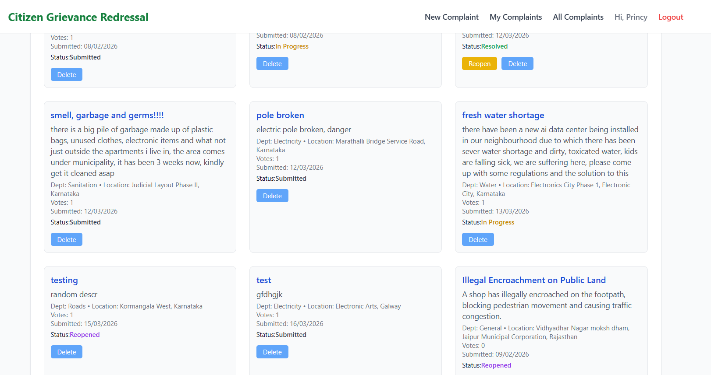

#### 💠 All Complaints Feed

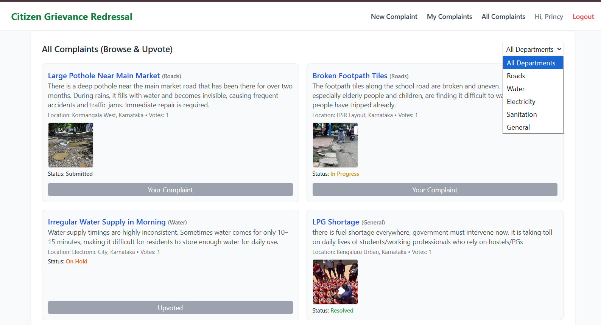

#### 💠 Complaint Detail View

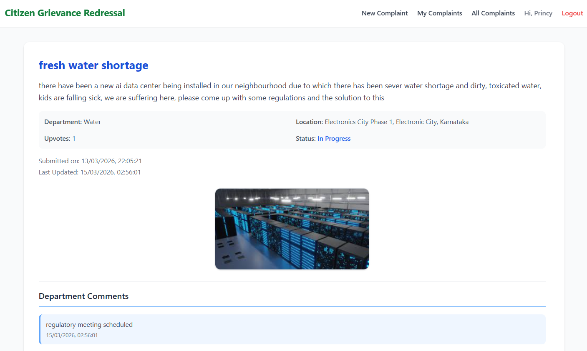

#### 💠 Duplicate Complaint Check

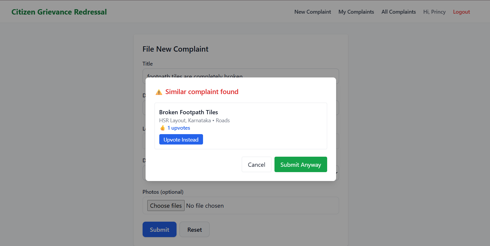

---

### 🏢 Authority Dashboard

#### 💠 Authority Panel

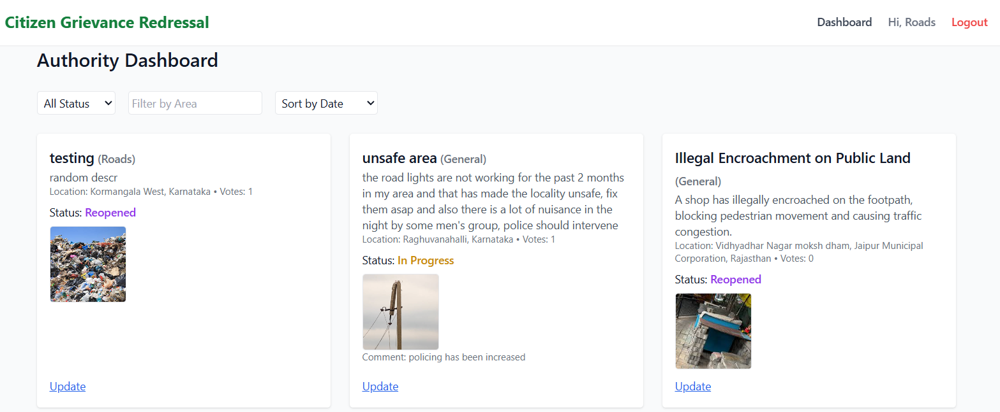

#### 💠 Status Update & Comments

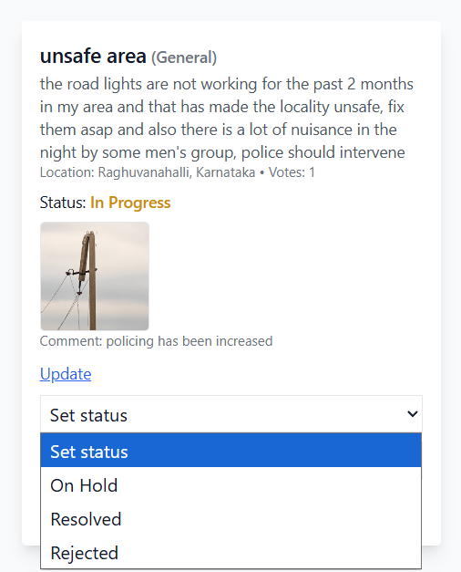
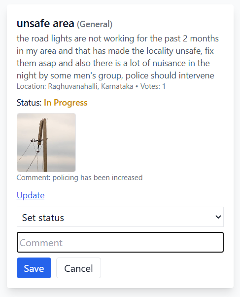

#### 💠 Sorting And Filtering

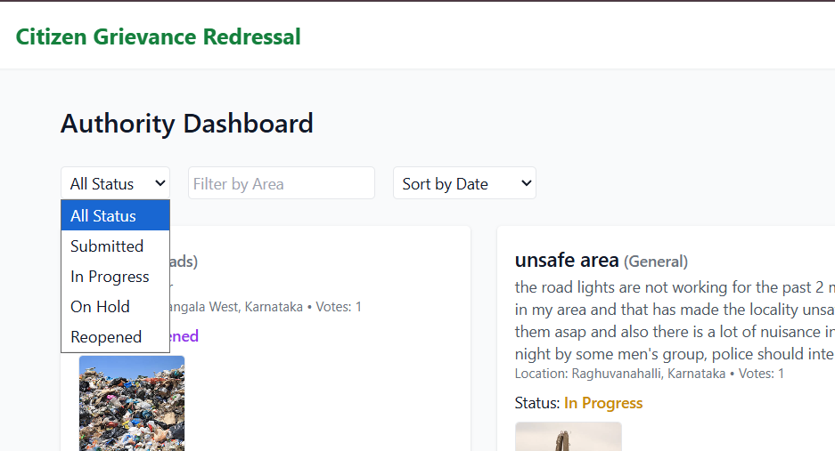
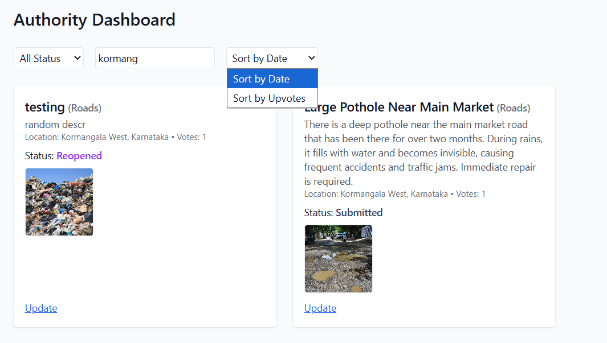

---

### 📧 System Features

#### 💠 Email Notification (Resend)

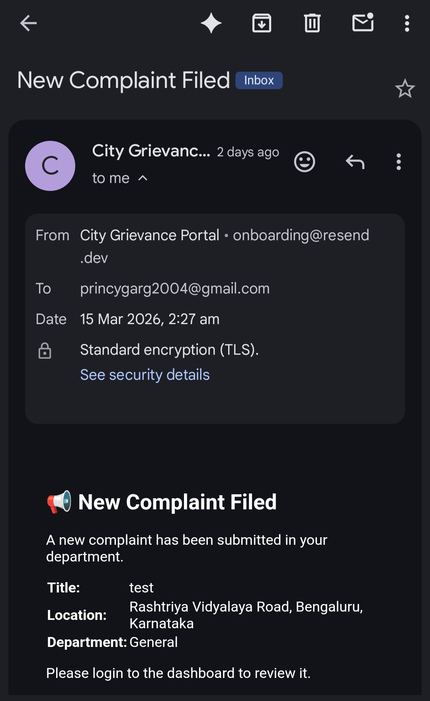
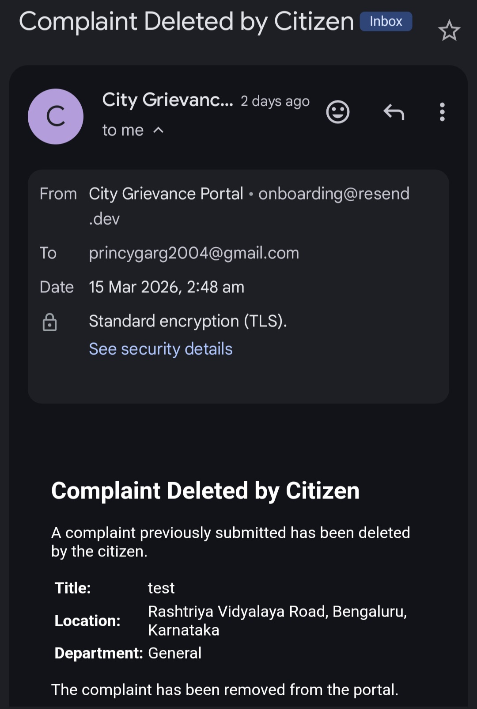
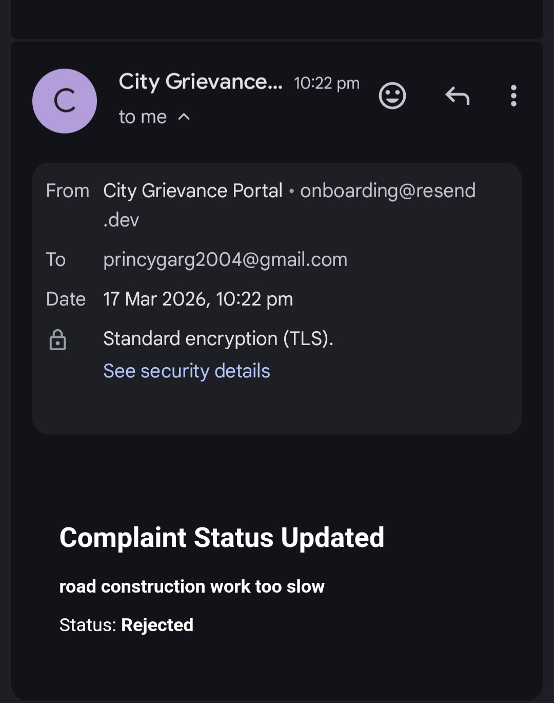
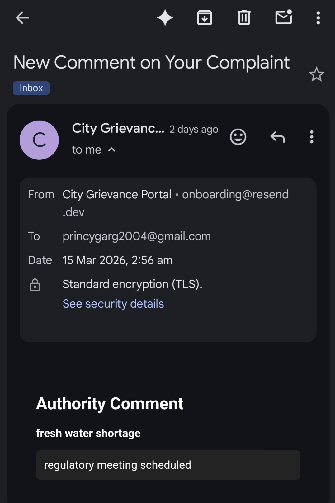
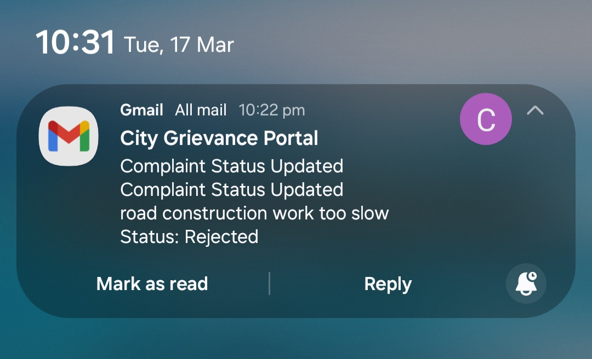

---

## 💡 Future Improvements

* 🔍 AI-based complaint categorization
* 📊 Analytics dashboard for authorities
* 🌍 Admin panel for surveillance
* 🌦 Weather-based insights (for civic issues)

---

## 🤝 Contributing

Pull requests are welcome. For major changes, please open an issue first.

---

## 👩‍💻 Author

**Princy Garg**

* GitHub: https://github.com/Codersworld-23
* Email: [princygarg2004@gmail.com](mailto:princygarg2004@gmail.com)

---

## ⭐ Show your support

If you like this project, give it a ⭐ on GitHub!